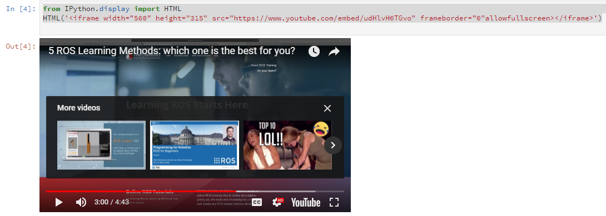

# AprendoMarkdown en JupyterNotebook
Ejercicios de Md para estudiantes que inician con GitHub y Jupyter Notebook


Para Youtube con botones FullScreen

```
from IPython.display import HTML
HTML('<iframe width="560" height="315"
src="https://www.youtube.com/embed/udHlvH6TGvo"
frameborder="0"allowfullscreen></iframe>')

```


